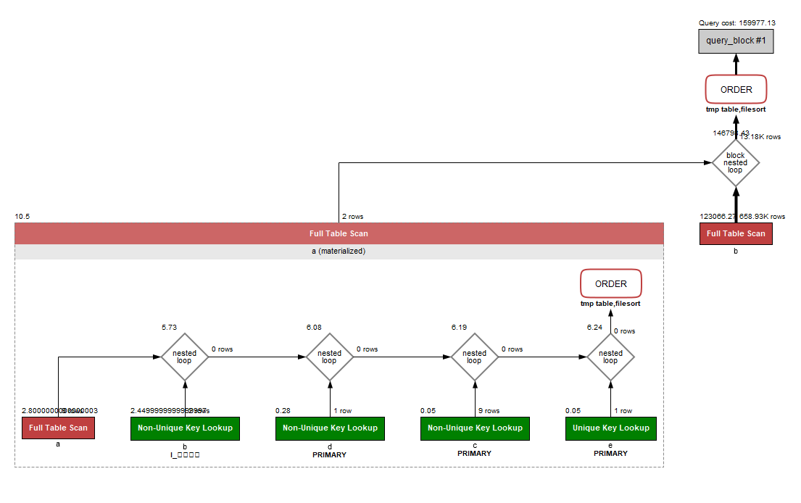
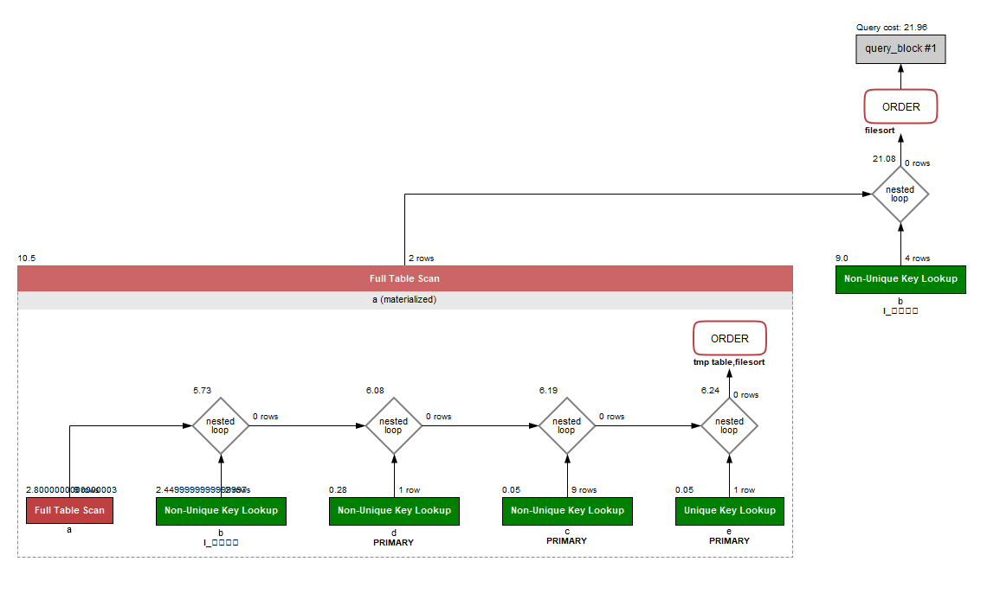
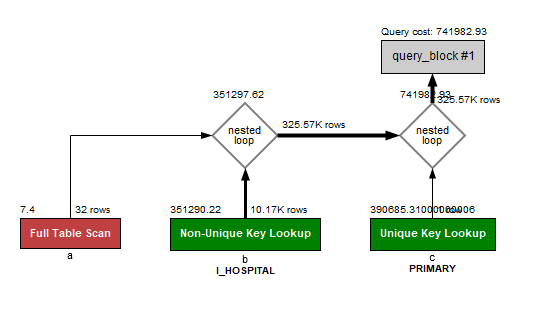
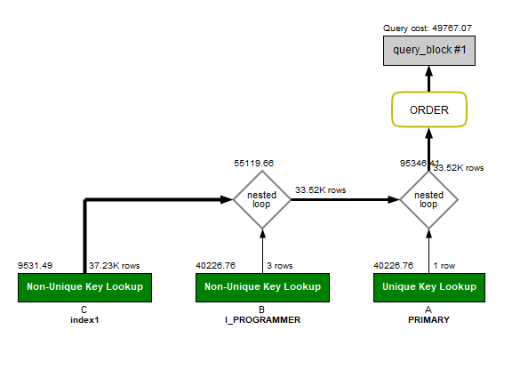
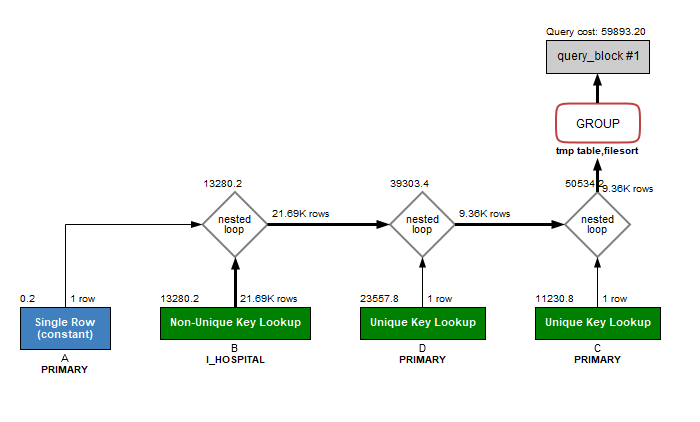

<p align="center">
    
</p>
<p align="center">
  
  
  <a href="https://edu.nextstep.camp/c/R89PYi5H" alt="nextstep atdd">
    
  </a>
  
</p>

<br>

# 인프라공방 샘플 서비스 - 지하철 노선도

<br>

## 🚀 Getting Started

### Install
#### npm 설치
```
cd frontend
npm install
```
> `frontend` 디렉토리에서 수행해야 합니다.

### Usage
#### webpack server 구동
```
npm run dev
```
#### application 구동
```
./gradlew clean build
```
<br>

## 미션

* 미션 진행 후에 아래 질문의 답을 작성하여 PR을 보내주세요.

### 1단계 - 화면 응답 개선하기
1. 성능 개선 결과를 공유해주세요 (Smoke, Load, Stress 테스트 결과)

2. 어떤 부분을 개선해보셨나요? 과정을 설명해주세요

---

### 2단계 - 조회 성능 개선하기
1. 인덱스 적용해보기 실습을 진행해본 과정을 공유해주세요
- **A. 쿼리 최적화**
- 최초 작성한 쿼리는 아래와 같고, 조회 건수, Druation / Fetch Time은 `14 row(s) returned	0.312 sec / 0.000 sec` 입니다. 실행계획은 아래 첨부한 이미지와 같습니다. 비교적 적은 건수를 담고 있는 부서 테이블로 Drive하도록 편안하게 작성했습니다.

    ```
    SELECT A.사원번호, A.이름, A.연봉, A.직급명, B.입출입시간, B.지역, B.입출입구분
    FROM
    (SELECT B.사원번호, E.이름, C.연봉, D.직급명 FROM 부서 A
    LEFT JOIN 부서관리자 B ON A.부서번호 = B.부서번호
    LEFT JOIN 직급 D ON B.사원번호 = D.사원번호
    LEFT JOIN 급여 C ON B.사원번호 = C.사원번호
    LEFT JOIN 사원 E ON B.사원번호 = E.사원번호
    WHERE A.비고 = 'ACTIVE'
    AND B.종료일자 = '9999-01-01'
    AND C.종료일자 = '9999-01-01'
    AND D.종료일자 = '9999-01-01'
    ORDER BY 연봉 DESC
    LIMIT 5) A LEFT JOIN 사원출입기록 B ON A.사원번호 = B.사원번호
    WHERE B.입출입구분 = 'O'
    ORDER BY A.연봉 DESC;
    ```
  
- 실행계획에서 확인한 것처럼 사원출입기록 테이블과 Join할 때 Full Table Scan이 일어나는 것을 확인했습니다. 해당 과정에서 많은 코스트가 발생하여 사원출입기록 테이블에 인덱스를 걸어주기로 했습니다. PK가 사원번호, 순번에 걸려있기는 했지만 사원번호만으로 조회할 때는 인덱스를 타지 않으므로, 사원번호 하나에만 인덱스를 걸어줍니다. duration이 비약적으로 줄어든 것을 확인할 수 있습니다. `14 row(s) returned	0.000 sec / 0.000 sec` 인덱스를 잘 타는 것도 보입니다
  

- **B. 인덱스 설계**

- B-1. Coding as a Hobby 와 같은 결과를 반환하세요.
  - Hobby 컬럼에 인덱스를 추가하여 `LIMIT 0, 2000	2 row(s) returned	0.360 sec / 0.000 sec` 에서 `2 row(s) returned	0.062 sec / 0.000 sec` 으로 개선할 수 있었습니다.
```
SELECT hobby, count(*)/(select count(*) count from programmer) as count
FROM programmer 
group by hobby;
```
- B-2. 프로그래머별로 해당하는 병원 이름을 반환하세요. (covid.id, hospital.name)
  - programmer 테이블에 id로 pk, covid 테이블에 hospital_id, programmer_id에 index를 추가하여 `318325 row(s) returned	0.015 sec / 3.235 sec` 으로 개선할 수 있었습니다
```
select c.id, a.name from hospital a 
left join covid b on a.id = b.hospital_id
left join programmer c on b.programmer_id = c.id;
```
  
- B-3. 프로그래밍이 취미인 학생 혹은 주니어(0-2년)들이 다닌 병원 이름을 반환하고 user.id 기준으로 정렬하세요. (covid.id, hospital.name, user.Hobby, user.DevType, user.YearsCoding)
  - 별도 인덱스 추가 없이 상기 쿼리에 조건만 추가해도 빠른 결과가 나왔습니다. `24537 row(s) returned	0.015 sec / 0.766 sec`
```
SELECT B.ID, A.NAME, C.HOBBY, C.DEV_TYPE, C.YEARS_CODING FROM HOSPITAL A 
LEFT JOIN COVID B ON A.ID = B.HOSPITAL_ID
LEFT JOIN PROGRAMMER C ON B.PROGRAMMER_ID = C.ID
WHERE (C.STUDENT IN ('YES, PART-TIME','YES, FULL-TIME') OR C.YEARS_CODING = '0-2 YEARS')
AND C.HOBBY = 'YES'
ORDER BY C.ID;
```
  
- B-4. 서울대병원에 다닌 20대 India 환자들을 병원에 머문 기간별로 집계하세요. (covid.Stay)
  - 최초 쿼리 작성 시 `10 row(s) returned	0.234 sec / 0.000 sec`이었으나, where 조건에 들어가는 컬럼들에 인덱스를 추가하고 join 순서를 조절하여 `10 row(s) returned	0.094 sec / 0.000 sec`으로 개선하였습니다
```
SELECT B.stay, count(*) FROM covid B
LEFT JOIN hospital A on A.ID = B.hospital_id
LEFT JOIN programmer C ON B.programmer_id = C.id
LEFT JOIN member D ON  D.id = B.member_id
WHERE C.country = 'India'
AND D.age between 20 and 29
AND A.id = 9
GROUP BY stay;
```
  
- B-5. 서울대병원에 다닌 30대 환자들을 운동 횟수별로 집계하세요. (user.Exercise)
  - 별도 인덱스 추가 없이 `5 row(s) returned	0.078 sec / 0.000 sec` 로 빠른 조회가 가능했다 
```
SELECT C.exercise, count(*) FROM covid B
LEFT JOIN hospital A on A.ID = B.hospital_id
LEFT JOIN programmer C ON B.programmer_id = C.id
LEFT JOIN member D ON  D.id = B.member_id
WHERE D.age between 30 and 39
AND A.id = 9
GROUP BY exercise;
```
  

2. 페이징 쿼리를 적용한 API endpoint를 알려주세요

