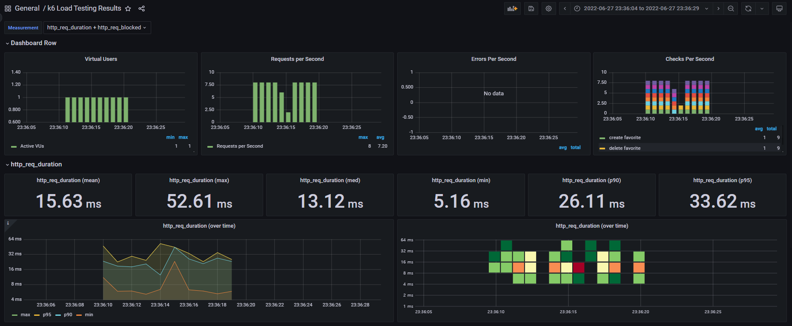
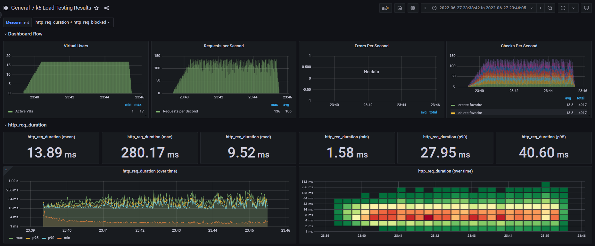
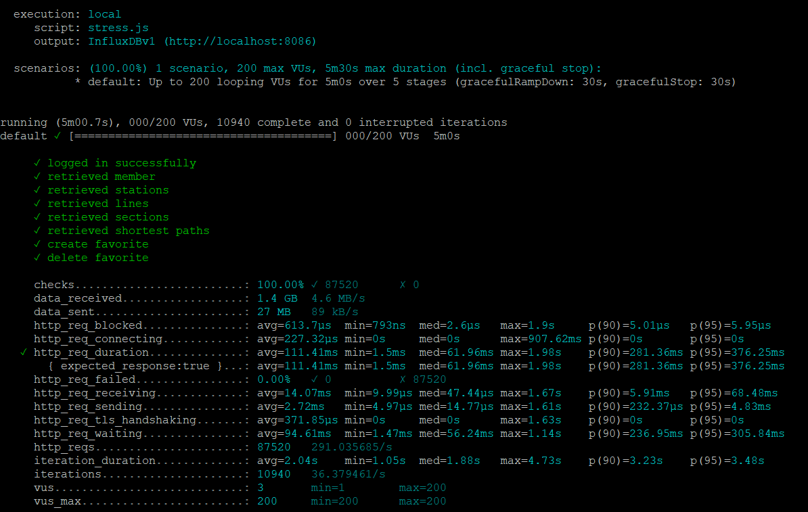
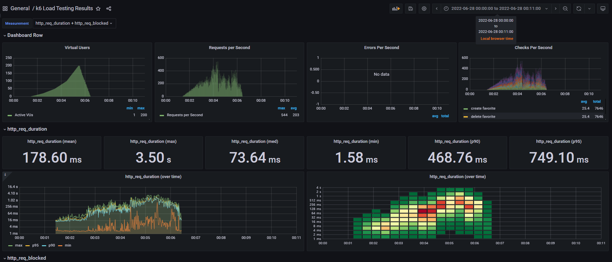

<p align="center">
    
</p>
<p align="center">
  
  
  <a href="https://edu.nextstep.camp/c/R89PYi5H" alt="nextstep atdd">
    
  </a>
  
</p>

<br>

# 인프라공방 샘플 서비스 - 지하철 노선도

<br>

## 🚀 Getting Started

### Install
#### npm 설치
```
cd frontend
npm install
```
> `frontend` 디렉토리에서 수행해야 합니다.

### Usage
#### webpack server 구동
```
npm run dev
```
#### application 구동
```
./gradlew clean build
```
<br>

## 미션

* 미션 진행 후에 아래 질문의 답을 작성하여 PR을 보내주세요.

## 요구사항 
### 1단계 
- [X] 부하테스트 각 시나리오의 요청시간을 목푯값 이하로 개선
  - 목표 요청시간(http_req_duration) = 0.1s
  - 목표 최대 RPS = 75

### 2단계 
- [X] springboot에 HTTP Cache, gzip 설정하기
- [ ] Launch Template 작성하기
- [ ] Auto Scaling Group 생성하기
- [ ] Smoke, Load, Stress 테스트 후 결과를 기록


### 1단계 - 화면 응답 개선하기
1. 성능 개선 결과를 공유해주세요 (Smoke, Load, Stress 테스트 결과)
#### 개선 이전
  - Smoke
    
  - Load
    
  - Stress
    

#### 개선 이후
  - Smoke
    
  - Load
    
  - Stress
    

#### 요약 (약 20~30퍼센트 성능개선)
  - Smoke(p95) : 63ms -> 33ms
  - Load(p95) : 65ms -> 40 ms
  - Stress(p95) : 480ms -> 376ms

#### 특이사항
  - Stress 테스트 결과가 성능 개선 시도 전보다 더 악화되어 나온 경우가 있었음
    
    - 테스트 진행 중에 `top` 명령어로 살펴보니 `load(EC2 Instance)`에 있는 `influxDB`의 메모리 사용율이 90퍼센트까지 올라가는걸 발견
    - grafana를 끄고 재시도한 Stress 테스트의 결과는 개선된걸로 나옴
  - redis를 새로 시작한 직후에 시도한 smoke 테스트는 성능 개선 전보다 지표가 좋지 않았음.

---

2. 어떤 부분을 개선해보셨나요? 과정을 설명해주세요
#### 웹서버 
- Gzip을 적용하여 응답메시지 압축
- HSTS를 적용해서 요청 수 최소화
- js, css, image에 대한 캐싱 적용

#### 애플리케이션
- 조회 서비스(역정보, 경로검색 등)에 Radis 캐시를 적용해서 의미없는 DB 접근 최소화

3. http2 적용
   
---

### 2단계 - 스케일 아웃
1. springboot에 HTTP Cache, gzip 설정하기 
    - 미션 3에 대한 답변 : no cache와 no store를 동시에 할 수는 없다. 
      - 우선 CacheControl에서 중복 설정이 불가능하다
      - no cache는 항상 ETag로 확인한 후 문제가 없는 경우 저장된 자원을 사용한다.
      - 문제는 no store인 경우 사용할 수 있는 자원이 없다는 것이다. 
      - 따라서 둘 중 하나만 선택해서 써야한다.

2. Launch Template 링크를 공유해주세요.

3. cpu 부하 실행 후 EC2 추가생성 결과를 공유해주세요. (Cloudwatch 캡쳐)

```sh
$ stress -c 2
```

3. 성능 개선 결과를 공유해주세요 (Smoke, Load, Stress 테스트 결과)

---

### 1단계 - 쿼리 최적화

1. 인덱스 설정을 추가하지 않고 아래 요구사항에 대해 1s 이하(M1의 경우 2s)로 반환하도록 쿼리를 작성하세요.

- 활동중인(Active) 부서의 현재 부서관리자 중 연봉 상위 5위안에 드는 사람들이 최근에 각 지역별로 언제 퇴실했는지 조회해보세요. (사원번호, 이름, 연봉, 직급명, 지역, 입출입구분, 입출입시간)

---

### 2단계 - 인덱스 설계

1. 인덱스 적용해보기 실습을 진행해본 과정을 공유해주세요

---

### 추가 미션

1. 페이징 쿼리를 적용한 API endpoint를 알려주세요
