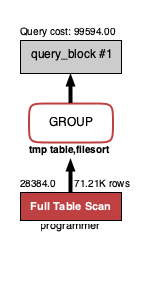
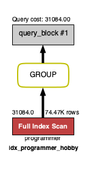
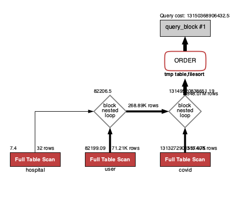
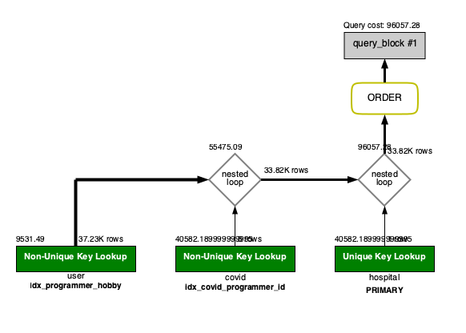
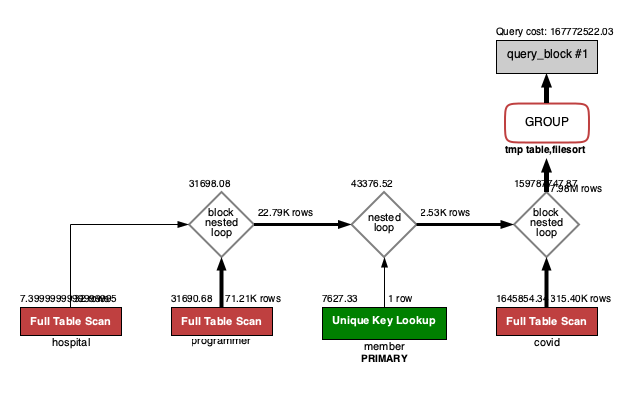
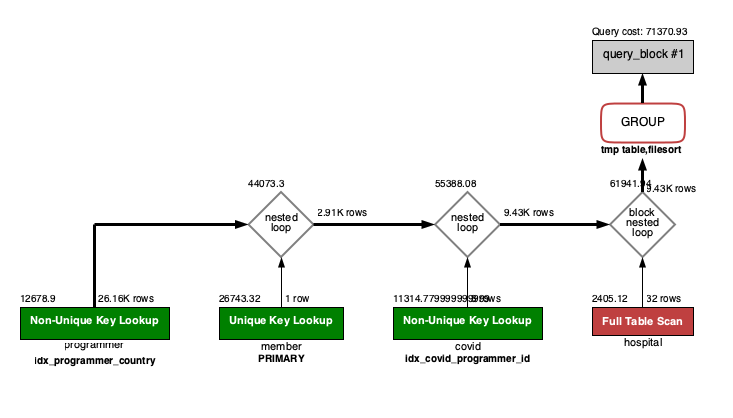

<p align="center">
    
</p>
<p align="center">
  
  
  <a href="https://edu.nextstep.camp/c/R89PYi5H" alt="nextstep atdd">
    
  </a>
  
</p>

<br>

# 인프라공방 샘플 서비스 - 지하철 노선도

<br>

## 🚀 Getting Started

### Install

#### npm 설치

```
cd frontend
npm install
```

> `frontend` 디렉토리에서 수행해야 합니다.

### Usage

#### webpack server 구동

```
npm run dev
```

#### application 구동

```
./gradlew clean build
```

<br>

## 미션

* 미션 진행 후에 아래 질문의 답을 작성하여 PR을 보내주세요.

### 1단계 - 화면 응답 개선하기

1. 성능 개선 결과를 공유해주세요 (Smoke, Load, Stress 테스트 결과)

2. 어떤 부분을 개선해보셨나요? 과정을 설명해주세요

---

### 2단계 - 조회 성능 개선하기

1. 인덱스 적용해보기 실습을 진행해본 과정을 공유해주세요
    - 실습 환경: macOS M1 Monterey 12.0.1

#### A. 쿼리 최적화

- [x] 활동중인(Active) 부서의 현재 부서관리자 중 연봉 상위 5위안에 드는 사람들이 최근에 각 지역별로 언제 퇴실했는지 조회해보세요.  
  (사원번호, 이름, 연봉, 직급명, 지역, 입출입구분, 입출입시간)
- 급여 테이블의 사용여부 필드는 사용하지 않습니다. 현재 근무중인지 여부는 종료일자 필드로 판단해주세요.

  ```mysql
  SELECT employee_rank.사원번호, employee_rank.이름, top_salary.연봉, employee_rank.직급명, access.지역, access.입출입구분, access.입출입시간
  FROM 사원출입기록 AS access
    INNER JOIN (
        SELECT salary.사원번호, salary.연봉
        FROM 급여 AS salary
          INNER JOIN 부서관리자 AS manager
            ON salary.사원번호 = manager.사원번호
            AND NOW() < manager.종료일자
          INNER JOIN 부서 AS department
            ON manager.부서번호 = department.부서번호
            AND department.비고 = 'active'
        WHERE NOW() < salary.종료일자
        ORDER BY salary.연봉
        DESC LIMIT 5 
    ) AS top_salary
      ON access.사원번호 = top_salary.사원번호
    INNER JOIN (
        SELECT employee.사원번호, employee.이름, rank.직급명
        FROM 사원 AS employee
          INNER JOIN 직급 AS rank
            ON employee.사원번호 = rank.사원번호
            AND NOW() < rank.종료일자 
    ) AS employee_rank
      ON access.사원번호 = employee_rank.사원번호
  WHERE access.입출입구분 = 'O'
  ORDER BY top_salary.연봉 DESC, access.지역;
  ```
- 인덱스 적용 전
  > 실행 결과: 14 row(s) returned	2.562 sec / 0.000022 sec

  

- 인덱스 적용 (1)
    - ``CREATE INDEX `idx_access_employee_number` ON `사원출입기록` (사원번호);``
  > 실행 결과: 14 row(s) returned	0.032 sec / 0.000016 sec

  

- 인덱스 적용 (2)
    - ``CREATE INDEX `idx_manager_end_date` ON `부서관리자` (`종료일자`)``
    - ``CREATE INDEX `idx_department_activation` ON `부서` (`비고`);``
  > 실행 결과: 14 row(s) returned	0.021 sec / 0.000013 sec

  

#### B. 인덱스 설계

- [ ] 주어진 데이터셋을 활용하여 아래 조회 결과를 100ms 이하로 반환
    - [x] Coding as a Hobby 와 같은 결과를 반환하세요.
    - [x] 프로그래머별로 해당하는 병원 이름을 반환하세요. (covid.id, hospital.name)
    - [x] 프로그래밍이 취미인 학생 혹은 주니어(0-2년)들이 다닌 병원 이름을 반환하고 user.id 기준으로 정렬하세요. (covid.id, hospital.name, user.Hobby, user.DevType, user.YearsCoding)
    - [x] 서울대병원에 다닌 20대 India 환자들을 병원에 머문 기간별로 집계하세요. (covid.Stay)
    - [x] 서울대병원에 다닌 30대 환자들을 운동 횟수별로 집계하세요. (user.Exercise)


- Coding as a Hobby 와 같은 결과를 반환하세요.
   ```mysql
   SELECT hobby, FORMAT(ROUND((COUNT(*) / (SELECT COUNT(*) FROM programmer)) * 100), 1) AS coding
   FROM programmer
   GROUP BY hobby;
   ```
  - 인덱스 적용 전
   > 실행 결과: 2 row(s) returned 5.400 sec / 0.0000081 sec

   

  - 인덱스 적용
    - ``CREATE INDEX `idx_programmer_hobby` ON `programmer` (hobby);``
   > 실행 결과: 2 row(s) returned 0.270 sec / 0.000010 sec

   


- 프로그래머별로 해당하는 병원 이름을 반환하세요.
   ```mysql
   SELECT covid.id, covid.programmer_id, hospital.name
   FROM covid
     INNER JOIN hospital
       ON covid.hospital_id = hospital.id
   WHERE covid.programmer_id IS NOT NULL;
   ```
    - PK 적용 전, 인덱스 적용 전
   > 실행 결과: 96180 row(s) returned	0.056 sec / 2.681 sec

   

    - PK 적용, 인덱스 적용
      - ``alter table `covid` add primary key (id);``
      - ``alter table `hospital` add primary key (id);``
      - ``CREATE INDEX `idx_covid_programmer_id` ON `covid` (programmer_id);``
   > 실행 결과: 96180 row(s) returned	0.037 sec / 1.349 sec

   


- 프로그래밍이 취미인 학생 혹은 주니어(0-2년)들이 다닌 병원 이름을 반환하고 user.id 기준으로 정렬하세요.
   ```mysql
   SELECT covid.id, hospital.name, user.hobby, user.dev_type, user.years_coding
   FROM programmer AS user
     INNER JOIN covid
       ON user.id = covid.programmer_id
     INNER JOIN  hospital
       ON hospital.id = covid.hospital_id
   WHERE user.hobby = 'yes' 
	 AND (user.student IN ('Yes, part-time', 'Yes, full-time')
          OR user.years_coding_prof = '0-2 years')
   ORDER BY user.id;
   ```
  - PK 적용 전, 인덱스 적용 전
  > 실행 결과: 30 sec 이상

  

  - PK 적용, 인덱스 적용
    - ``alter table `hospital` add primary key (id);``
    - ``CREATE INDEX `idx_covid_programmer_id` ON `covid` (programmer_id);``
    - ``CREATE INDEX `idx_covid_programmer_hobby` ON `covid` (hobby);``
  > 실행 결과: 31448 row(s) returned	0.037 sec / 4.492 sec


  


- 서울대병원에 다닌 20대 India 환자들을 병원에 머문 기간별로 집계하세요.
   ```mysql
   SELECT covid.stay, COUNT(covid.stay) AS programer_count
   FROM programmer
     INNER JOIN member
       ON programmer.member_id = member.id
       AND member.age BETWEEN 20 AND 29
     INNER JOIN covid
       ON programmer.id = covid.programmer_id
     INNER JOIN hospital
       ON covid.hospital_id = hospital.id
       AND hospital.name = '서울대병원'
   WHERE country = 'India'
   GROUP BY covid.stay;
   ```
  - 인덱스 적용 전
  > 실행 결과: 30 sec 이상

  

  - 인덱스 적용
    - ``CREATE INDEX `idx_programmer_country` ON `programmer` (country);``
    - ``CREATE INDEX `idx_covid_programmer_id` ON `covid` (programmer_id);``
  > 실행 결과: 10 row(s) returned	2.217 sec / 0.000019 sec

  


- 서울대병원에 다닌 30대 환자들을 운동 횟수별로 집계하세요.
   ```mysql
   SELECT user.exercise, COUNT(user.exercise) AS exercise_count
   FROM programmer AS user
     INNER JOIN member
       ON user.member_id = member.id
       AND member.age BETWEEN 30 AND 39
     INNER JOIN covid
       ON user.id = covid.programmer_id
     INNER JOIN hospital
       ON covid.hospital_id = hospital.id
       AND hospital.name = '서울대병원'
   GROUP BY user.exercise;
   ```
  - PK 적용 전, 인덱스 적용 전
  > 실행 결과: 30 sec 이상

  

  - PK 적용, 인덱스 적용
    - ``alter table `hospital` add primary key (id);``
    - ``CREATE INDEX `idx_covid_programmer_id` ON `covid` (programmer_id);``
  > 5 row(s) returned	4.496 sec / 0.000019 sec

  


2. 페이징 쿼리를 적용한 API endpoint를 알려주세요

  - https://subway-deploy.kro.kr/lines/page?page=5&size=1
  - https://subway-deploy.kro.kr/stations/page?size=10

