<p align="center">
    
</p>
<p align="center">
  
  
  <a href="https://edu.nextstep.camp/c/R89PYi5H" alt="nextstep atdd">
    
  </a>
  
</p>

<br>

# 인프라공방 샘플 서비스 - 지하철 노선도

<br>

## 🚀 Getting Started

### Install
#### npm 설치
```
cd frontend
npm install
```
> `frontend` 디렉토리에서 수행해야 합니다.

### Usage
#### webpack server 구동
```
npm run dev
```
#### application 구동
```
./gradlew clean build
```
<br>

## 미션

* 미션 진행 후에 아래 질문의 답을 작성하여 PR을 보내주세요.

### 1단계 - 화면 응답 개선하기
1. 성능 개선 결과를 공유해주세요 (Smoke, Load, Stress 테스트 결과)

총 3개의 시나리오로 테스트 수행

1. 메인 페이지
2. 사용자 로그인 이후 내 정보 업데이트
3. 최적 경로 탐색

### 설정 전

1. 메인 페이지

- max=113.93ms p(90)=27.27ms p(95)=32.97ms
- 이미 95%의 응답이 50ms 이하 이므로 개선의 필요성 없음

```java

					/\      |‾‾| /‾‾/   /‾‾/
     /\  /  \     |  |/  /   /  /
    /  \/    \    |     (   /   ‾‾\
   /          \   |  |\  \ |  (‾)  |
  / __________ \  |__| \__\ \_____/ .io

  execution: local
     script: main.js
     output: -

  scenarios: (100.00%) 1 scenario, 100 max VUs, 1m40s max duration (incl. graceful stop):
           * default: Up to 100 looping VUs for 1m10s over 2 stages (gracefulRampDown: 30s, gracefulStop: 30s)

running (1m10.7s), 000/100 VUs, 3479 complete and 0 interrupted iterations
default ✓ [======================================] 000/100 VUs  1m10s

     ✓ enter main page

     checks.........................: 100.00% ✓ 3479     ✗ 0
     data_received..................: 4.8 MB  68 kB/s
     data_sent......................: 421 kB  5.9 kB/s
     http_req_blocked...............: avg=1.86ms   min=2µs     med=7µs     max=1.11s    p(90)=11µs    p(95)=17µs
     http_req_connecting............: avg=780.75µs min=0s      med=0s      max=1.07s    p(90)=0s      p(95)=0s
   ✓ http_req_duration..............: avg=19.67ms  min=11.37ms med=17.54ms max=113.93ms p(90)=27.27ms p(95)=32.97ms
       { expected_response:true }...: avg=19.67ms  min=11.37ms med=17.54ms max=113.93ms p(90)=27.27ms p(95)=32.97ms
     http_req_failed................: 0.00%   ✓ 0        ✗ 3479
     http_req_receiving.............: avg=96.52µs  min=21µs    med=95µs    max=1.23ms   p(90)=139µs   p(95)=163µs
     http_req_sending...............: avg=34.21µs  min=6µs     med=31µs    max=551µs    p(90)=50µs    p(95)=66µs
     http_req_tls_handshaking.......: avg=1.07ms   min=0s      med=0s      max=165.18ms p(90)=0s      p(95)=0s
     http_req_waiting...............: avg=19.53ms  min=11.25ms med=17.41ms max=113.79ms p(90)=27.11ms p(95)=32.79ms
     http_reqs......................: 3479    49.19618/s
     iteration_duration.............: avg=1.02s    min=1.01s   med=1.01s   max=2.12s    p(90)=1.03s   p(95)=1.04s
     iterations.....................: 3479    49.19618/s
     vus............................: 8       min=2      max=99
     vus_max........................: 100     min=100    max=100
```

2. 로그인 이후, 로그인 사용자 정보 수정

- max=320.41ms p(90)=31.39ms p(95)=37.14ms
- 이미 95%의 응답이 50ms 이하 이므로 개선의 필요성 없음

```java
          /\      |‾‾| /‾‾/   /‾‾/
     /\  /  \     |  |/  /   /  /
    /  \/    \    |     (   /   ‾‾\
   /          \   |  |\  \ |  (‾)  |
  / __________ \  |__| \__\ \_____/ .io

  execution: local
     script: load.js
     output: -

  scenarios: (100.00%) 1 scenario, 200 max VUs, 2m40s max duration (incl. graceful stop):
           * default: Up to 200 looping VUs for 2m10s over 3 stages (gracefulRampDown: 30s, gracefulStop: 30s)

running (2m10.9s), 000/200 VUs, 12415 complete and 0 interrupted iterations
default ✓ [======================================] 000/200 VUs  2m10s

     ✓ logged in successfully
     ✓ retrieved member

     checks.........................: 100.00% ✓ 24830      ✗ 0
     data_received..................: 9.5 MB  72 kB/s
     data_sent......................: 6.3 MB  48 kB/s
     http_req_blocked...............: avg=433.31µs min=1µs     med=5µs     max=292.15ms p(90)=9µs     p(95)=11µs
     http_req_connecting............: avg=135.31µs min=0s      med=0s      max=180.38ms p(90)=0s      p(95)=0s
   ✗ http_req_duration..............: avg=25.73ms  min=12.01ms med=22.71ms max=320.41ms p(90)=31.39ms p(95)=37.14ms
       { expected_response:true }...: avg=25.73ms  min=12.01ms med=22.71ms max=320.41ms p(90)=31.39ms p(95)=37.14ms
     http_req_failed................: 0.00%   ✓ 0          ✗ 24830
     http_req_receiving.............: avg=77.74µs  min=17µs    med=70µs    max=1.28ms   p(90)=124µs   p(95)=149µs
     http_req_sending...............: avg=30.58µs  min=6µs     med=27µs    max=1.82ms   p(90)=49µs    p(95)=59µs
     http_req_tls_handshaking.......: avg=291.34µs min=0s      med=0s      max=166.48ms p(90)=0s      p(95)=0s
     http_req_waiting...............: avg=25.62ms  min=11.95ms med=22.6ms  max=320.34ms p(90)=31.28ms p(95)=37.03ms
     http_reqs......................: 24830   189.730367/s
     iteration_duration.............: avg=1.05s    min=1.02s   med=1.04s   max=1.45s    p(90)=1.06s   p(95)=1.08s
     iterations.....................: 12415   94.865183/s
     vus............................: 12      min=2        max=200
     vus_max........................: 200     min=200      max=200

ERRO[0132] some thresholds have failed
```

3. 경로 조회 페이지

- max=5.66s    p(90)=4.24s p(95)=5.01s
- 이미 95%의 응답이 50ms 이하 이므로 개선이 필요

```java
          /\      |‾‾| /‾‾/   /‾‾/
     /\  /  \     |  |/  /   /  /
    /  \/    \    |     (   /   ‾‾\
   /          \   |  |\  \ |  (‾)  |
  / __________ \  |__| \__\ \_____/ .io

  execution: local
     script: path.js
     output: -

  scenarios: (100.00%) 1 scenario, 200 max VUs, 2m40s max duration (incl. graceful stop):
           * default: Up to 200 looping VUs for 2m10s over 3 stages (gracefulRampDown: 30s, gracefulStop: 30s)

running (2m11.8s), 000/200 VUs, 4099 complete and 0 interrupted iterations
default ✓ [======================================] 000/200 VUs  2m10s

     ✓ find path successfully

     checks.........................: 100.00% ✓ 4099      ✗ 0
     data_received..................: 26 MB   197 kB/s
     data_sent......................: 760 kB  5.8 kB/s
     http_req_blocked...............: avg=3.38ms   min=2µs     med=8µs   max=211.99ms p(90)=13µs  p(95)=58.19µs
     http_req_connecting............: avg=1.13ms   min=0s      med=0s    max=86.79ms  p(90)=0s    p(95)=0s
   ✗ http_req_duration..............: avg=2.28s    min=93.74ms med=2.2s  max=5.66s    p(90)=4.24s p(95)=5.01s
       { expected_response:true }...: avg=2.28s    min=93.74ms med=2.2s  max=5.66s    p(90)=4.24s p(95)=5.01s
     http_req_failed................: 0.00%   ✓ 0         ✗ 4099
     http_req_receiving.............: avg=132.64µs min=24µs    med=122µs max=3.23ms   p(90)=202µs p(95)=234µs
     http_req_sending...............: avg=42.31µs  min=9µs     med=39µs  max=1.87ms   p(90)=60µs  p(95)=83.09µs
     http_req_tls_handshaking.......: avg=2.22ms   min=0s      med=0s    max=173.33ms p(90)=0s    p(95)=0s
     http_req_waiting...............: avg=2.28s    min=93.53ms med=2.2s  max=5.66s    p(90)=4.24s p(95)=5.01s
     http_reqs......................: 4099    31.106284/s
     iteration_duration.............: avg=3.28s    min=1.09s   med=3.2s  max=6.66s    p(90)=5.2s  p(95)=6.02s
     iterations.....................: 4099    31.106284/s
     vus............................: 18      min=2       max=200
     vus_max........................: 200     min=200     max=200
```

### 2. nginx 설정 이후

1. 경로 조회

- 개선 전 : max=5.66s    p(90)=4.24s p(95)=5.01s
- 개선 후 : max=12.55s   p(90)=6.11s   p(95)=6.94s
- 개선 전 보다 약 40%의 응답속도 느려짐
- nginx에서의 설정은 대부분 캐시에 관한 설정이므로 nginx의 worker_process에 관한 문제인 것으로 추정
- 현재 서버의 cpu 코어는 2개이므로 worker_process 2개로 작업할 것으로 추정, 각 process의 worker_connection이 10,240개 이므로 200개의 요청을 충분히 처리할 것으로 예상
- nginx의 /nginx_status 설정 후 nginx의 connection 확인 결과 모든 요청이 성공됨을 확인할 수 있었다
- 서버측의 데이터베이스에서 병목이 발생하는 것으로 추정

```java
Active connections: 245 
server accepts handled requests
 769 769 44076 
Reading: 0 Writing: 1 Waiting: 244
```

```java
          /\      |‾‾| /‾‾/   /‾‾/
     /\  /  \     |  |/  /   /  /
    /  \/    \    |     (   /   ‾‾\
   /          \   |  |\  \ |  (‾)  |
  / __________ \  |__| \__\ \_____/ .io

  execution: local
     script: path.js
     output: -

  scenarios: (100.00%) 1 scenario, 200 max VUs, 2m40s max duration (incl. graceful stop):
           * default: Up to 200 looping VUs for 2m10s over 3 stages (gracefulRampDown: 30s, gracefulStop: 30s)

running (2m13.9s), 000/200 VUs, 4134 complete and 0 interrupted iterations
default ✓ [======================================] 000/200 VUs  2m10s

     ✓ find path successfully

     checks.........................: 100.00% ✓ 4134      ✗ 0
     data_received..................: 26 MB   195 kB/s
     data_sent......................: 471 kB  3.5 kB/s
     http_req_blocked...............: avg=2.51ms   min=0s      med=1µs   max=220.42ms p(90)=4µs     p(95)=250.99µs
     http_req_connecting............: avg=726.12µs min=0s      med=0s    max=27.84ms  p(90)=0s      p(95)=0s
   ✗ http_req_duration..............: avg=2.29s    min=92.65ms med=1.41s max=12.55s   p(90)=6.11s   p(95)=6.94s
       { expected_response:true }...: avg=2.29s    min=92.65ms med=1.41s max=12.55s   p(90)=6.11s   p(95)=6.94s
     http_req_failed................: 0.00%   ✓ 0         ✗ 4134
     http_req_receiving.............: avg=1.18ms   min=59µs    med=368µs max=117.28ms p(90)=2.42ms  p(95)=7.19ms
     http_req_sending...............: avg=455.32µs min=26µs    med=285µs max=17.85ms  p(90)=787.4µs p(95)=1.18ms
     http_req_tls_handshaking.......: avg=1.75ms   min=0s      med=0s    max=187.23ms p(90)=0s      p(95)=0s
     http_req_waiting...............: avg=2.29s    min=92.19ms med=1.41s max=12.54s   p(90)=6.11s   p(95)=6.94s
     http_reqs......................: 4134    30.871944/s
     iteration_duration.............: avg=3.29s    min=1.09s   med=2.42s max=13.55s   p(90)=7.12s   p(95)=7.95s
     iterations.....................: 4134    30.871944/s
     vus............................: 19      min=2       max=199
     vus_max........................: 200     min=200     max=200
```

### 3. redis 설정 이후

1. 경로 조회

- 개선 전 : max=12.55s   p(90)=6.11s   p(95)=6.94s
- 개선 후 : max=164.08ms p(90)=27.34ms p(95)=30.01ms
- 개선 전 보다 230배 응답속도 빨라짐
- 같은 요청을 redis의 메모리에 저장하고 있어 기존의 하드디스크에서 조회하는 것보다 높은 성능

```java
          /\      |‾‾| /‾‾/   /‾‾/
     /\  /  \     |  |/  /   /  /
    /  \/    \    |     (   /   ‾‾\
   /          \   |  |\  \ |  (‾)  |
  / __________ \  |__| \__\ \_____/ .io

  execution: local
     script: path.js
     output: -

  scenarios: (100.00%) 1 scenario, 200 max VUs, 2m40s max duration (incl. graceful stop):
           * default: Up to 200 looping VUs for 2m10s over 3 stages (gracefulRampDown: 30s, gracefulStop: 30s)

running (2m10.7s), 000/200 VUs, 12764 complete and 0 interrupted iterations
default ✓ [======================================] 000/200 VUs  2m10s

     ✓ find path successfully

     checks.........................: 100.00% ✓ 12764    ✗ 0
     data_received..................: 79 MB   601 kB/s
     data_sent......................: 1.2 MB  9.3 kB/s
     http_req_blocked...............: avg=808.84µs min=0s      med=1µs     max=175.9ms  p(90)=3µs     p(95)=3µs
     http_req_connecting............: avg=241.95µs min=0s      med=0s      max=48.88ms  p(90)=0s      p(95)=0s
   ✓ http_req_duration..............: avg=21.29ms  min=13.06ms med=20.12ms max=164.08ms p(90)=27.34ms p(95)=30.01ms
       { expected_response:true }...: avg=21.29ms  min=13.06ms med=20.12ms max=164.08ms p(90)=27.34ms p(95)=30.01ms
     http_req_failed................: 0.00%   ✓ 0        ✗ 12764
     http_req_receiving.............: avg=1.31ms   min=27µs    med=235µs   max=26.66ms  p(90)=4.46ms  p(95)=7.75ms
     http_req_sending...............: avg=301.72µs min=17µs    med=132µs   max=27.72ms  p(90)=567µs   p(95)=890.84µs
     http_req_tls_handshaking.......: avg=554.68µs min=0s      med=0s      max=142.04ms p(90)=0s      p(95)=0s
     http_req_waiting...............: avg=19.67ms  min=0s      med=18.76ms max=163.96ms p(90)=24.45ms p(95)=27.27ms
     http_reqs......................: 12764   97.67372/s
     iteration_duration.............: avg=1.02s    min=1.01s   med=1.02s   max=1.21s    p(90)=1.03s   p(95)=1.03s
     iterations.....................: 12764   97.67372/s
     vus............................: 11      min=2      max=199
     vus_max........................: 200     min=200    max=200
```

### 4. async 설정 이후

1. 경로 조회

- max=164.08ms p(90)=27.34ms p(95)=30.01ms
- max=414.01ms p(90)=27.45ms p(95)=31.68ms
- 이전과 비슷한 응답 속도를 보임
- 처음 비동기 요청 이후 모두 redis에서 호출하므로 성능 변화 없다
- 만약 redis 이전에 설정을 했다면 뚜렸한 성능 변화가 있었을 것이라 예상된다

```java
          /\      |‾‾| /‾‾/   /‾‾/
     /\  /  \     |  |/  /   /  /
    /  \/    \    |     (   /   ‾‾\
   /          \   |  |\  \ |  (‾)  |
  / __________ \  |__| \__\ \_____/ .io

  execution: local
     script: path.js
     output: -

  scenarios: (100.00%) 1 scenario, 200 max VUs, 2m40s max duration (incl. graceful stop):
           * default: Up to 200 looping VUs for 2m10s over 3 stages (gracefulRampDown: 30s, gracefulStop: 30s)

running (2m10.8s), 000/200 VUs, 12772 complete and 0 interrupted iterations
default ✓ [======================================] 000/200 VUs  2m10s

     ✓ find path successfully

     checks.........................: 100.00% ✓ 12772    ✗ 0
     data_received..................: 2.3 MB  18 kB/s
     data_sent......................: 677 kB  5.2 kB/s
     http_req_blocked...............: avg=985.32µs min=0s      med=1µs     max=303.76ms p(90)=3µs     p(95)=3µs
     http_req_connecting............: avg=290.37µs min=0s      med=0s      max=56.86ms  p(90)=0s      p(95)=0s
   ✓ http_req_duration..............: avg=21.39ms  min=11.04ms med=19.67ms max=414.01ms p(90)=27.45ms p(95)=31.68ms
       { expected_response:true }...: avg=21.39ms  min=11.04ms med=19.67ms max=414.01ms p(90)=27.45ms p(95)=31.68ms
     http_req_failed................: 0.00%   ✓ 0        ✗ 12772
     http_req_receiving.............: avg=125.83µs min=9µs     med=68µs    max=17.53ms  p(90)=189µs   p(95)=254µs
     http_req_sending...............: avg=321.52µs min=17µs    med=181µs   max=15.56ms  p(90)=652µs   p(95)=802µs
     http_req_tls_handshaking.......: avg=676.95µs min=0s      med=0s      max=270.68ms p(90)=0s      p(95)=0s
     http_req_waiting...............: avg=20.94ms  min=3.93ms  med=19.23ms max=413.7ms  p(90)=26.88ms p(95)=31.15ms
     http_reqs......................: 12772   97.65853/s
     iteration_duration.............: avg=1.02s    min=1.01s   med=1.02s   max=1.53s    p(90)=1.03s   p(95)=1.03s
     iterations.....................: 12772   97.65853/s
     vus............................: 9       min=2      max=199
     vus_max........................: 200     min=200    max=200
```

3. 어떤 부분을 개선해보셨나요? 과정을 설명해주세요

## 1. 서버 정적 리소스 캐싱

- 변경 내용
    - 어플리케이션에서 잘 바뀌지 않는 정적 리소스들을 캐시하여 브라우저 응답 속도를 높히도록 설정
    - 서버에서 정적 리소스 요청시 cache-controller에 max-age로 1년 설정
    - eTag를 통해 리소스 업데이트 여부 확인
    - 배포 시간으로 정적 리소스 위치 업데이트
- 결과
    - 서버 응답에서 cache-control, etag, last-modified 헤더 확인
    - 이후 요청에서 if-none-modified 헤더를 보낼 것으로 예상했지만 그렇지 않음
    - 아마 브라우저의 메모리에서 캐시된 것을 사용하는 것으로 추정

## 2. 정적 파일 경량화

- 변경 내용
    - nginx에서 정적 리소스를 압축하고 캐싱하여 브라우저 응답 속도를 높히도록 설정
    - nginx의 gzip 설정
        - Vary:Accept-Encoding 헤더를 삽입하여 요청 헤더를 보낸 클라이언트에게만 캐싱된 응답을 보내도록 설정
        - vender.js : 2.2mb → 416kb로 압축, 응답 속도 189ms → 156ms
    - nginx의 정적 리소스 캐싱
        - X-Proxy-Cache 헤더를 설정하여 새로 브라우저를 열었을 때 HIT된 캐시를 보여주도록 설정
- 결과
    - 설정 전 성능점수 67점에서 92점으로 성능 개선
    - LCP를 4.685s에서 3.442s로 개선

### 설정 전 측정

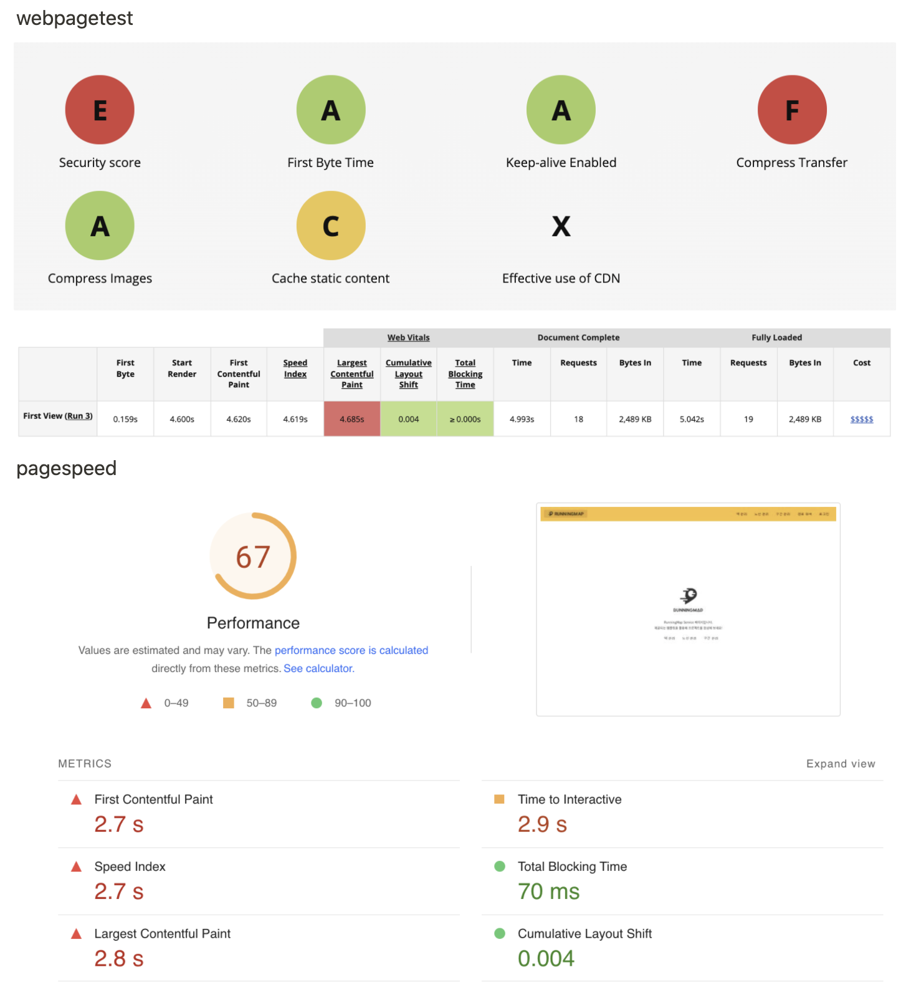

### nginx 설정 이후 측정

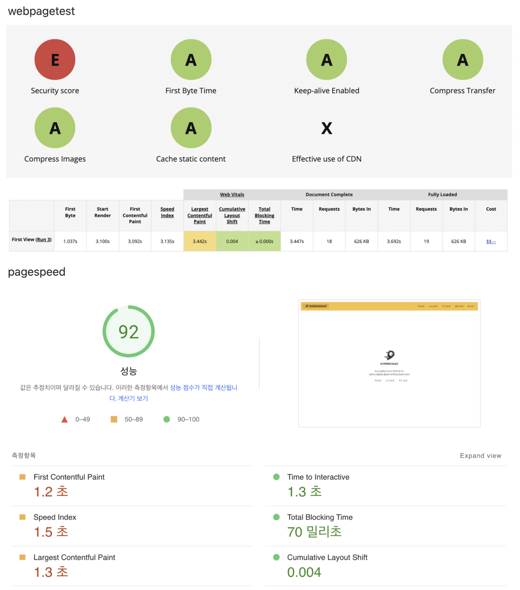

## 3. redis

- 메모리 데이터베이스인 레디스로 자주 사용되지만 변경되지 않는 요청의 반환값을 캐싱한다
- 또한 성능문제가 가장 컸던 경로 탐색에 대해 캐시 설정을 하였다.
- 개선 전 : max=12.55s   p(90)=6.11s   p(95)=6.94s
- 개선 후 : max=164.08ms p(90)=27.34ms p(95)=30.01ms
- 기존 보다 230배 정도의 성능 개선을 보였다

```java
@Cacheable(value = "path", key = "{#source + '_' + #target}")
public PathResponse findPath(Long source, Long target) {
    List<Line> lines = lineService.findLines();
    Station sourceStation = stationService.findById(source);
    Station targetStation = stationService.findById(target);
    SubwayPath subwayPath = pathService.findPath(lines, sourceStation, targetStation);

    return PathResponseAssembler.assemble(subwayPath);
}
```

## 4. async

- 적절한 스레드 수를 찾아서 비동기 스레드 풀을 설정한다
    - CPU당 물리 코어 수 : 2
    - 물리 CPU 수 : 1
    - 리눅스 전체 코어(프로세스)개수 : 2
    - 적절한 스레드 수 : 4 (사용가능한 코어수의 두배)
- 또한 성능문제가 가장 컸던 경로 탐색에 대해 비동기 처리(@Async)를 하였지만 비동기 동작 전에 redis에서 캐시된 데이터가 응답하여 성능상 큰 변화는 없었다

```java
@Async
@Cacheable(value = "path", key = "{#source + '_' + #target}")
public PathResponse findPath(Long source, Long target) {
    List<Line> lines = lineService.findLines();
    Station sourceStation = stationService.findById(source);
    Station targetStation = stationService.findById(target);
    SubwayPath subwayPath = pathService.findPath(lines, sourceStation, targetStation);

    return PathResponseAssembler.assemble(subwayPath);
}
```

---

### 2단계 - 조회 성능 개선하기
1. 인덱스 적용해보기 실습을 진행해본 과정을 공유해주세요

### 1. Coding as a Hobby 와 같은 결과를 반환하세요.
```sql
SELECT hobby, ROUND((COUNT(1)/(SELECT COUNT(1) FROM programmer)) * 100, 1) AS percentage
FROM programmer
GROUP BY hobby;
```
개선전
- 실행시간 : 4.224초

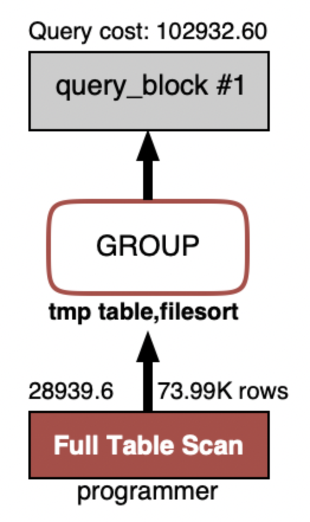


개선작업
- ID에 PK와 조건을 추가하여 서브쿼리에서 인덱스를 사용하도록 추가. 
- 하지만 조건절이 없기 때문에 전체 테이블 스캔과 인덱스 스캔이 성능상 동일하여 옵티마이저가 여전히 full table scan을 하고 있는 것으로 추정
```sql
alter table subway.programmer add constraint programmer_pk primary key (id);
```
- hobby에 인덱스를 추가
- GROUP BY 절에서 임시로 테이블을 생성하는 대신 인덱스에서 처리. 
- 앞서 id를 인덱스 테이블에서 처리했기 때문에 인덱스 테이블 내에서 정렬된 hobby 테이블을 참조했다고 추정.
```sql
create index idx_programmer_hobby using btree on subway.programmer (hobby);
```

개선 후
- 실행시간 : 4.224초 -> 0.283초

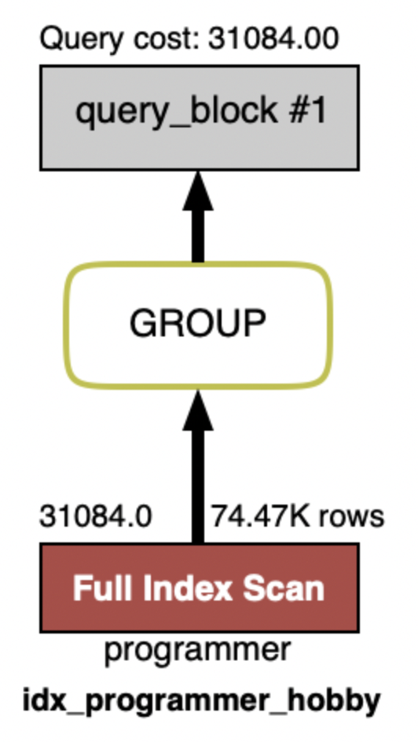

### 2. 프로그래머별로 해당하는 병원 이름을 반환하세요. (covid.id, hospital.name)
```sql
SELECT c.id, h.name
FROM covid c
JOIN hospital h
ON c.hospital_id = h.id;
```
개선 전
- 실행시간 : 52ms


개선 작업
- 이미 50ms이므로 추가 개선작업이 필요없지만 optimizer를 개선하는 작업 추가
- covid, hospital 테이블에서 full table scan을 하고 있음
```sql
create index idx_hospital_id using btree on subway.covid (hospital_id);
```
- covid 테이블의 hospital_id에 인덱스를 추가하여 non unique key lookup을 사용하도록 변경
```sql
create index idx_hospital_name using btree on subway.hospital (name);
```

개선 후 
- 실행시간 : 20ms

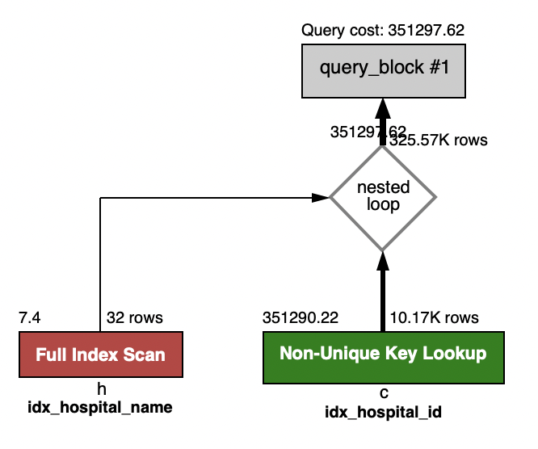

### 3. 프로그래밍이 취미인 학생 혹은 주니어(0-2년)들이 다닌 병원 이름을 반환하고 user.id 기준으로 정렬하세요. (covid.id, hospital.name, user.Hobby, user.DevType, user.YearsCoding)
```sql
SELECT p.id, h.name, p.student, p.hobby, p.dev_type, p.years_coding
FROM programmer p, covid c, hospital h
WHERE p.id = c.programmer_id
AND c.hospital_id = h.id
AND p.hobby = 'Yes' 
AND (p.student LIKE 'Yes%' OR p.years_coding = '0-2 years')
ORDER BY p.id
```
개선 전
- 실행시간 : 19.243s

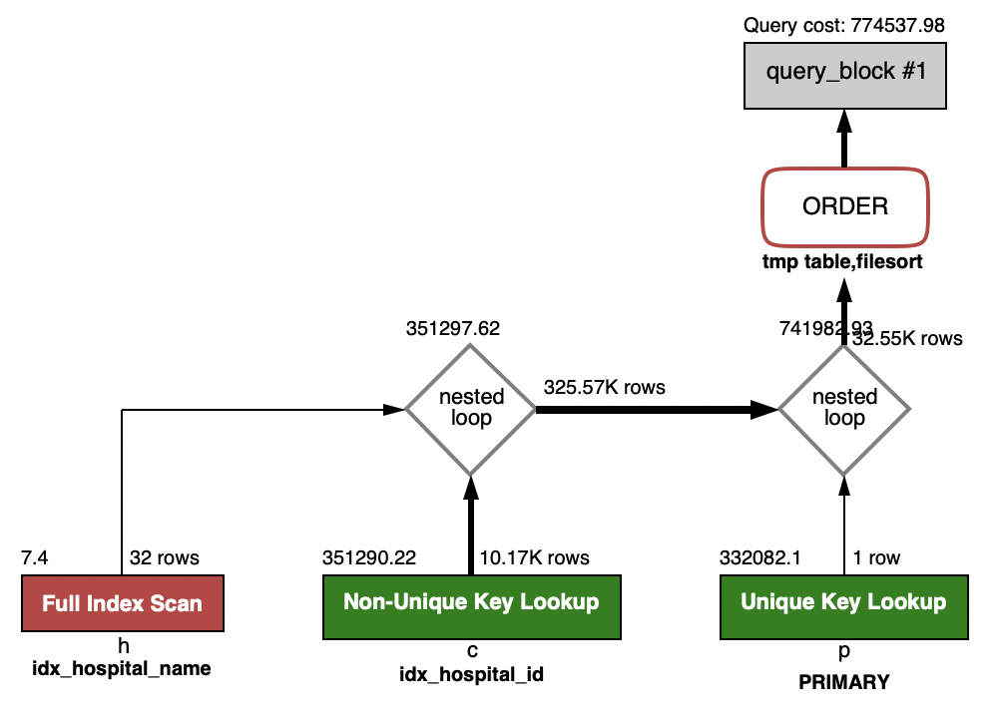

개선 작업 
- order by절에서 tmp table과 filter sort 중
- 인덱스에서 바로 조회할 수 있도록 수정 
```sql
create index idx_covid_programmer_id_hospital_id using btree on subway.covid (programmer_id, hospital_id);
```
- covid 테이블의 programmer_id와 hospital_id를 인덱스로 설정
- 여러 인덱스를 테스트하던 중 가장 성능이 좋은 인덱스였지만 어떤 인과관계로 성능이 좋아진지는 모르겠음 

개선 후
- 실행시간 : 20ms

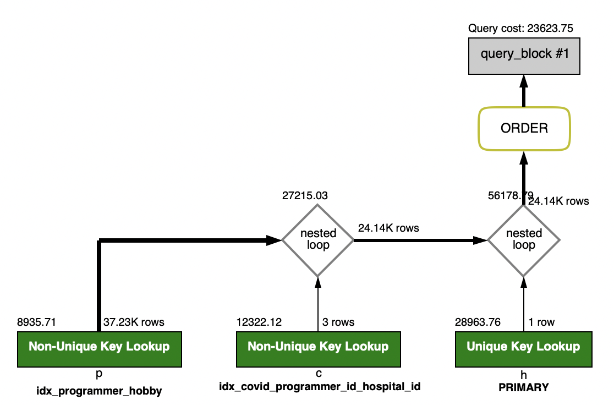

### 4. 서울대병원에 다닌 20대 India 환자들을 병원에 머문 기간별로 집계하세요. (covid.Stay)
```sql
select c.stay, count(1)
from subway.covid c,
     subway.member m,
     subway.programmer p,
     subway.hospital h
where c.member_id = m.id
  and c.programmer_id = p.id
  and c.hospital_id = h.id
  and h.name = '서울대병원'
  and p.country = 'india'
  and m.age between 20 and 29
group by c.stay
```

개선 전 
- 실행시간 : 156ms

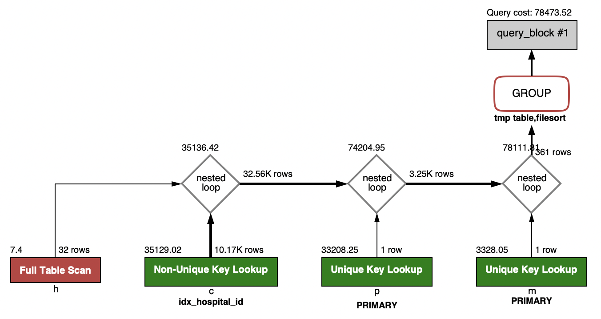

개선작업
- order by에 tmp table과 file sort 중
- hospital 테이블에서 full table scan 사용 중
```sql
create index idx_hospital_name using btree on subway.hospital (name);
```
- hospital 테이블의 name 컬럼에 인덱스를 지정하여 non unique key lookup 사용
```sql
order by null
```
- order by null로 file sort 제거

개선 후
- 실행시간 : 140ms

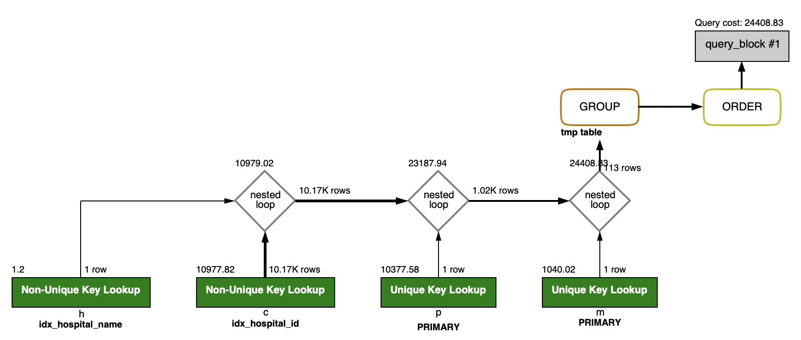

### 5. 서울대병원에 다닌 30대 환자들을 운동 횟수별로 집계하세요. (user.Exercise)

```sql
SELECT p.exercise, count(1)
FROM subway.covid c,
     subway.member m,
     subway.programmer p,
     subway.hospital h
WHERE c.member_id = m.id
  AND c.programmer_id = p.id
  AND c.hospital_id = h.id
  AND h.name = '서울대병원'
  AND m.age between 30 and 39
GROUP BY p.exercise;
```

개선 전
- 실행시간 : 187ms

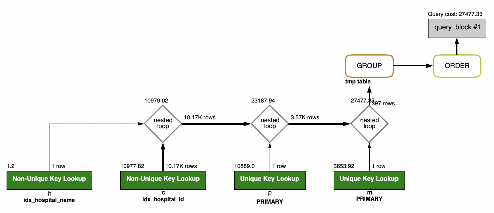


개선작업
- order by에 tmp table과 file sort 중
```sql
order by null
```
- order by null로 file sort 제거

개선 후
- 실행시간 : 152ms;

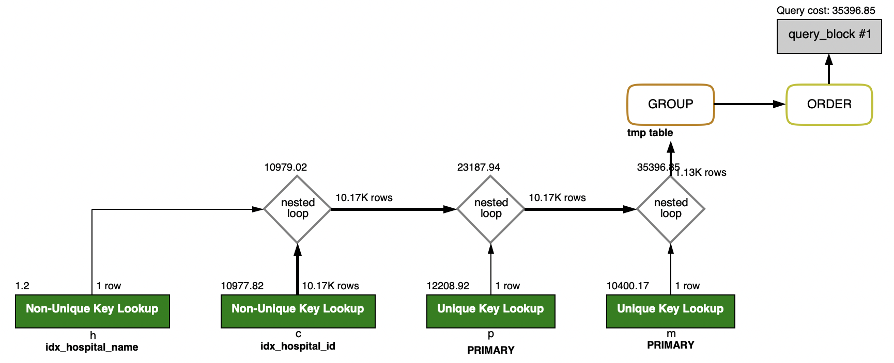

2. 페이징 쿼리를 적용한 API endpoint를 알려주세요

https://bgpark82.p-e.kr/favorites
