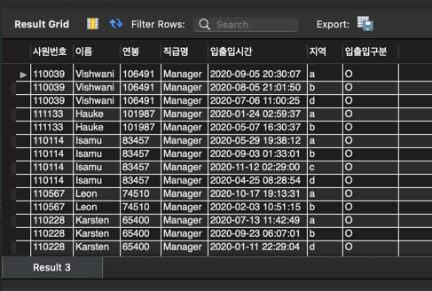

<p align="center">
    
</p>
<p align="center">
  
  
  <a href="https://edu.nextstep.camp/c/R89PYi5H" alt="nextstep atdd">
    
  </a>
  
</p>

<br>

# 인프라공방 샘플 서비스 - 지하철 노선도

<br>

## 🚀 Getting Started

### Install

#### npm 설치

```
cd frontend
npm install
```

> `frontend` 디렉토리에서 수행해야 합니다.

### Usage

#### webpack server 구동

```
npm run dev
```

#### application 구동

```
./gradlew clean build
```

<br>

## 미션

* 미션 진행 후에 아래 질문의 답을 작성하여 PR을 보내주세요.

### 1단계 - 화면 응답 개선하기

1. 성능 개선 결과를 공유해주세요 (Smoke, Load, Stress 테스트 결과)
   - docs 디렉토리내 파일로 공유

2. 어떤 부분을 개선해보셨나요? 과정을 설명해주세요
   - nginx(Reverse Proxy) http2 적용 및 캐시 정책, gzip 압축 설정
   - Spring Cache 설정

---

### 2단계 - 스케일 아웃

1. Launch Template 링크를 공유해주세요.
   - https://ap-northeast-2.console.aws.amazon.com/ec2/v2/home?region=ap-northeast-2#LaunchTemplates:search=14km
2. cpu 부하 실행 후 EC2 추가생성 결과를 공유해주세요. (Cloudwatch 캡쳐)
   - docs - step2 - ec2 페이지 내 공유

```sh
$ stress -c 2
```

3. 성능 개선 결과를 공유해주세요 (Smoke, Load, Stress 테스트 결과)

- docs -> step2 이미지 참조

4. 모든 정적 자원에 대해 no-cache, no-store 설정을 한다. 가능한가요?
   - 가능은 정적 자원이 자주 호출되는지 등을 따져서 하나 자원에 효율성에 대해서 생각을 해봐야할 것 같습니다. (정적 컨텐츠에 캐시를 사용하는 이유 등..)
   - no-store(캐시를 등록하지 않음), no-cache(캐시를 사용하나, 서버에 검증이 필요)

---

### 3단계 - 쿼리 최적화

1. 인덱스 설정을 추가하지 않고 아래 요구사항에 대해 1s 이하(M1의 경우 2s)로 반환하도록 쿼리를 작성하세요.

```sql
SELECT result.id            as 사원번호,
       result.last_name     as 이름,
       result.annual_income as 연봉,
       result.position_name as 직급명,
       r.time               as 입출입시간,
       r.region             as 지역,
       r.record_symbol      as 입출입구분
from (select e.id, e.last_name, s.annual_income, p.position_name
      from manager
              inner join department department on manager.department_id = department.id
              inner join employee e on manager.employee_id = e.id
              inner join position p on p.id = e.id
              inner join salary s on s.id = e.id
      where department.note = 'active'
        and p.position_name = "Manager"
        and s.end_date = '9999-01-01'
        and p.end_date = '9999-01-01'
      order by s.annual_income DESC limit 5) as result
        INNER join record as r ON r.employee_id = result.id
where r.record_symbol = 'O'

```

- 활동중인(Active) 부서의 현재 부서관리자 중 연봉 상위 5위안에 드는 사람들이 최근에 각 지역별로 언제 퇴실했는지 조회해보세요. (사원번호, 이름, 연봉, 직급명, 지역, 입출입구분, 입출입시간)
  

---

### 4단계 - 인덱스 설계

1. 인덱스 적용해보기 실습을 진행해본 과정을 공유해주세요

---

### 추가 미션

1. 페이징 쿼리를 적용한 API endpoint를 알려주세요
