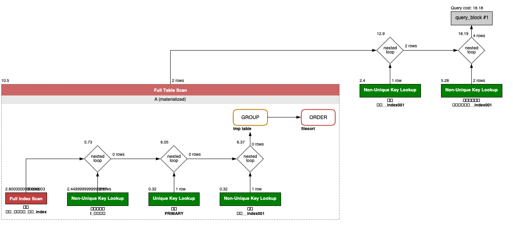
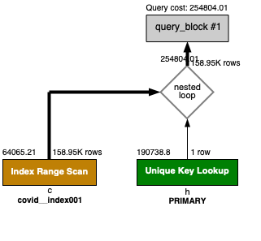

<p align="center">
    
</p>
<p align="center">
  
  
  <a href="https://edu.nextstep.camp/c/R89PYi5H" alt="nextstep atdd">
    
  </a>
  
</p>

<br>

# 인프라공방 샘플 서비스 - 지하철 노선도

<br>

## 🚀 Getting Started

### Install
#### npm 설치
```
cd frontend
npm install
```
> `frontend` 디렉토리에서 수행해야 합니다.

### Usage
#### webpack server 구동
```
npm run dev
```
#### application 구동
```
./gradlew clean build
```
<br>

## 미션

* 미션 진행 후에 아래 질문의 답을 작성하여 PR을 보내주세요.

### 1단계 - 화면 응답 개선하기
1. 성능 개선 결과를 공유해주세요 (Smoke, Load, Stress 테스트 결과)
 - `/k6/public1/scenario3_result.md` -> 캐시 미적용 인스턴스 결과
 - `/k6/public2/scenario3_result.md` -> 캐시 적용 인스턴스 결과
2. 어떤 부분을 개선해보셨나요? 과정을 설명해주세요
   `단건 조회` 시 캐시를 적용하였습니다.
   station, line 에 대해 캐시를 적용하여 경로 조회 시 성능을 개선하였습니다.
   
---

### 2단계 - 조회 성능 개선하기
1. 인덱스 적용해보기 실습을 진행해본 과정을 공유해주세요
    1) 쿼리를 작성한다.
    2) mysql `explain` 과 workbench 에서 제공하는 `explain ui` 기능으로 쿼리 성능 및 cost를 검증한다.
    3) full scan 에 대한 부분에 인덱스를 사용한다.
    4) 조인 순서를 변경하여 성능을 개선한다.

2. 페이징 쿼리를 적용한 API endpoint를 알려주세요
    1) `/lines/page`
    2) `/stations/page`

--- 

### 2단계 요구사항 

#### A.쿼리 최적화
 - 쿼리 작성만으로 1s 이하로 반환한다.
 - 인덱스 설정을 추가하여 50 ms 이하로 반환한다.
 - [x] 활동중인(Active) 부서의 현재 부서관리자 중 연봉 상위 5위안에 드는 사람들이 최근에 각 지역별로 언제 퇴실했는지 조회해보세요.
   - (사원번호, 이름, 연봉, 직급명, 지역, 입출입구분, 입출입시간)
   - 급여 테이블의 사용여부 필드는 사용하지 않습니다. 현재 근무중인지 여부는 종료일자 필드로 판단해주세요.
   - result
     - 
     
     - `부서.비고` 인덱스 설정 
     - `부서관리자.종료일자` 인덱스 설정
     - `사원출입기록.입출입구분&사원번호` 인덱스 설정


#### B. 인덱스 설계
 * 요구사항
- [x] 주어진 데이터셋을 활용하여 아래 조회 결과를 100ms 이하로 반환
   - [x] Coding as a Hobby 와 같은 결과를 반환하세요.
   - result 
     - 
     
     - `programmer.hobby` 인덱스 설정
     - `programmer.id` pk 설정 
   
   - [x] 프로그래머별로 해당하는 병원 이름을 반환하세요. (covid.id, hospital.name)
   - result
     - 
    
     - `hospital.id` pk 설정
     - `hospital.name` not null, varchar 타입으로 변경
     - `covid.programmer_id` 인덱스 설정
     
   - [x] 프로그래밍이 취미인 학생 혹은 주니어(0-2년)들이 다닌 병원 이름을 반환하고 user.id 기준으로 정렬하세요. (covid.id, hospital.name, user.Hobby, user.DevType, user.YearsCoding)
   - result
      - 
            
      - `programmer.hobby&student&years_coding` 인덱스 설정  

   - [x] 서울대병원에 다닌 20대 India 환자들을 병원에 머문 기간별로 집계하세요. (covid.Stay)
   - result 
      - 

      - `member.age`  인덱스 설정 
     
   - [x] 서울대병원에 다닌 30대 환자들을 운동 횟수별로 집계하세요. (user.Exercise)
   - result
      - 
     
      - 추가 설정 없음.

#### C. 페이징 쿼리
 - [x] 페이징 쿼리 구현
    - /lines/page
    - /stations/page
   
 - 웹 애플리케이션에서는 테이블의 내용을 1~20건 단위로 나눠서 보여주는 것이 일반적입니다. 테이블의 레코드를 일정 단위로 잘라서 조회하는 것을 페이징 쿼리라고 합니다. 
 - 일반적으로는 아래와 같이 작성합니다.
```sql
SELECT * FROM subway.programmer ORDER BY id LIMIT 20, 10;
```
 - 이렇게 작성할 경우에 10개의 레코드만 읽는게 아니라, 첫번째 레코드부터 20번째 레코드까지 읽어서 버리고 10개의 레코드를 읽어 반환합니다.
 - 이에 뒷 페이지로 갈수록 성능이 급격히 저하됩니다. 따라서 아래와 같이, 테이블의 PK를 WHERE 조건절에 넣어주는 것이 좋습니다.

```sql
SELECT * FROM subway.programmer
    WHERE subway.programmer.id >= 20000
        ORDER BY id LIMIT 0, 10;
```
 - Spring Data JPQL은 LIMIT 명령어를 지원하지 않으므로, Pageable 객체를 활용해야 합니다.
```jpaql
@Query("SELECT * FROM subway.programmer WHERE subway.programmer.id >= ?1")
List<User> findAll(Pageable pg);
``` 

#### D. MySQL Replication with JPA
 - [x] replication 설정 
 - MySQL Replication의 master/slave는 1:n관계입니다.
 - master는 갱신쿼리를 바이너리 로그파일로 기록하고, 이 로그파일의 내용이 slave로 전송되어 순차적으로 실행함으로써 복제됩니다.
 - 따라서 MySQL Replication은 준동시성입니다. I/O 스레드가 비동기로 동작하기에 마스터에서 생성한 바이너리 로그가 슬레이브에 수신되기 전에 장애가 날 경우 손실이 발생할 수 있습니다.
 - 데이터조작쿼리(INSERT, UPDATE, DELETE)는 마스터로, 데이터조회쿼리(SELECT)는 슬레이브로 받아서 부하를 분산할 수 있습니다.
 - 아래 설정을 참고하여 MySQL Replication 구성을 해봅니다. 애플리케이션과 DB를 연결하는 작업은 다음 단계에서 진행합니다.

##### master 서버 설정
```text
$ docker run --name mysql-master -p 13306:3306 -v ~/mysql/master:/etc/mysql/conf.d -e MYSQL_ROOT_PASSWORD=masterpw -d mysql

$ docker exec -it mysql-master /bin/bash
$ mysql -u root -p  
mysql> CREATE USER 'replication_user'@'%' IDENTIFIED WITH mysql_native_password by 'replication_pw';  
mysql> GRANT REPLICATION SLAVE ON *.* TO 'replication_user'@'%'; 

mysql> SHOW MASTER STATUS\G  
*************************** 1. row ***************************
             File: binlog.000002
         Position: 683
     Binlog_Do_DB: 
 Binlog_Ignore_DB: 
Executed_Gtid_Set: 
1 row in set (0.00 sec)
```
#### slave 서버 설정
```text
$ docker run --name mysql-slave -p 13307:3306 -v ~/mysql/slave:/etc/mysql/conf.d -e MYSQL_ROOT_PASSWORD=slavepw -d mysql

$ docker exec -it mysql-slave /bin/bash
$ mysql -u root -p  

mysql> SET GLOBAL server_id = 2;
mysql> CHANGE MASTER TO MASTER_HOST='172.17.0.1', MASTER_PORT = 13306, MASTER_USER='replication_user', MASTER_PASSWORD='replication_pw', MASTER_LOG_FILE='binlog.000002', MASTER_LOG_POS=683;  

mysql> START SLAVE;  
mysql> SHOW SLAVE STATUS\G
...
            Slave_IO_Running: Yes
            Slave_SQL_Running: Yes
```

#### 애플리케이션 설정
```properties
spring.datasource.hikari.master.username=root
spring.datasource.hikari.master.password=masterpw
spring.datasource.hikari.master.jdbc-url=jdbc:mysql://localhost:13306/subway?useSSL=false&useUnicode=yes&characterEncoding=UTF-8&serverTimezone=UTC&allowPublicKeyRetrieval=true

spring.datasource.hikari.slave.username=root
spring.datasource.hikari.slave.password=slavepw
spring.datasource.hikari.slave.jdbc-url=jdbc:mysql://localhost:13307/subway?useSSL=false&useUnicode=yes&characterEncoding=UTF-8&serverTimezone=UTC&allowPublicKeyRetrieval=true
```

```java
public class ReplicationRoutingDataSource extends AbstractRoutingDataSource {
    public static final String DATASOURCE_KEY_MASTER = "master";
    public static final String DATASOURCE_KEY_SLAVE = "slave";

    @Override
    protected Object determineCurrentLookupKey() {
        boolean isReadOnly = TransactionSynchronizationManager.isCurrentTransactionReadOnly();
        return (isReadOnly)
            ? DATASOURCE_KEY_SLAVE
            : DATASOURCE_KEY_MASTER;
    }
}
```

```java
@Configuration
@EnableAutoConfiguration(exclude = {DataSourceAutoConfiguration.class})
@EnableTransactionManagement
@EnableJpaRepositories(basePackages = {"nextstep.subway"})
class DataBaseConfig {

  @Bean
  @ConfigurationProperties(prefix = "spring.datasource.hikari.master")
  public DataSource masterDataSource() {
    return DataSourceBuilder.create().type(HikariDataSource.class).build();
  }

  @Bean
  @ConfigurationProperties(prefix = "spring.datasource.hikari.slave")
  public DataSource slaveDataSource() {
    return DataSourceBuilder.create().type(HikariDataSource.class).build();
  }

  @Bean
  public DataSource routingDataSource(@Qualifier("masterDataSource") DataSource master,
                                      @Qualifier("slaveDataSource") DataSource slave) {
    ReplicationRoutingDataSource routingDataSource = new ReplicationRoutingDataSource();

    HashMap<Object, Object> sources = new HashMap<>();
    sources.put(DATASOURCE_KEY_MASTER, master);
    sources.put(DATASOURCE_KEY_SLAVE, slave);

    routingDataSource.setTargetDataSources(sources);
    routingDataSource.setDefaultTargetDataSource(master);

    return routingDataSource;
  }

  @Primary
  @Bean
  public DataSource dataSource(@Qualifier("routingDataSource") DataSource routingDataSource) {
    return new LazyConnectionDataSourceProxy(routingDataSource);
  }
}
```

```text
  public List<Line> findLines() {    
    ...
    
    @Transactional(readOnly = true)
    public List<StationResponse> findAllStations() {
```

> findLines() 메서드는 master에서 findAllStations() 메서드는 slave에서 조회합니다.
> @Transactional(readOnly = true)를 사용할 경우 slave를 활용합니다.


